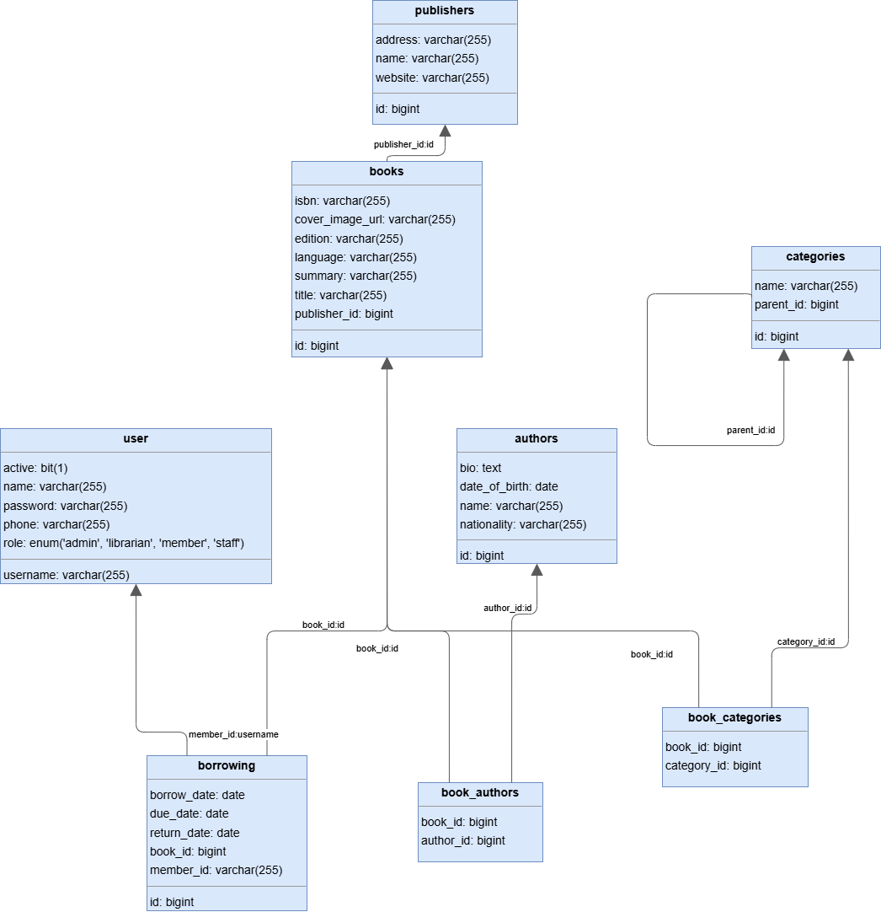

# Library Management System

This is a **Library Management System** built with **Spring Boot**. It features **JWT Authentication**, **Role-Based Access Control (RBAC)**, and supports various user roles: `ADMIN`, `LIBRARIAN`, `STAFF`, and `MEMBER`.


---
## Project ERD

## 📦 Project Structure


## API Testing

The file `Library.postman_collection.json` contains a Postman collection with sample requests for all API endpoints. You can import it into Postman to easily test the system.


```
com.example.Library
│
├── authentication
│   ├── AuthenticationController
│   ├── AuthenticationRequest
│   ├── AuthenticationResponse
│   ├── AuthenticationService
│   └── RegisterRequest
│
├── config
│   ├── ApplicationConfig
│   ├── JwtAuthenticationFilter
│   ├── JwtService
│   └── SecurityConfig
│
├── controller
│   ├── AuthorController
│   ├── BookController
│   ├── BorrowingController
│   ├── CategoryController
│   └── PublisherController
│
├── dto
│   ├── AuthorDTO
│   ├── BookDTO
│   ├── BorrowingDTO
│   ├── CategoryDTO
│   └── PublisherDTO
│
├── model
│   ├── Author
│   ├── Book
│   ├── Borrowing
│   ├── Category
│   └── Publisher
│
├── repository
│   ├── AuthorRepository
│   ├── BookRepository
│   ├── BorrowingRepository
│   ├── CategoryRepository
│   ├── PublisherRepository
│   └── UserRepository
│
├── service
│   ├── AuthorService
│   ├── BookService
│   ├── BorrowingService
│   ├── CategoryService
│   └── PublisherService
│
├── user
│   ├── Role (enum)
│   └── User
│
└── util
    └── LibraryApplication (Main class)
```

**Borrowings** table serves as an intermediary entity to effectively manage and track the relationship between **Books** and **Users** in the system. Here’s why it is important:

- **Represents Many-to-Many Relationships:**  
  A single user can borrow multiple books over time, and a single book can be borrowed by many different users (at different times). The Borrowings table captures this many-to-many relationship by linking users and books with additional contextual information.

- **Tracks Borrowing Details:**  
  This table stores important information about each borrowing event, such as:
  - Borrow date  
  - Due date  
  - Return date  
---

## 🛡️ Roles & Permissions

| Role        | Description                                           | Can Create?     | Can Update?     | Can Delete?     | Can Read? |
| ----------- | ----------------------------------------------------- | --------------- | --------------- | --------------- | --------- |
| `ADMIN`     | Full access to all resources and system management    | ✅               | ✅               | ✅               | ✅         |
| `LIBRARIAN` | Manage books, authors, categories, and users          | ✅               | ✅               | ✅               | ✅         |
| `STAFF`     | Assist in book management (limited to specific tasks) | ❌ (assist only) | ✅ (assist only) | ❌ (assist only) | ✅         |
| `MEMBER`    | Borrow and return books                               | ❌               | ❌               | ❌               | ✅         |

**Access Control Example:**

```java
// Only Admins and Librarians can create Authors
@PreAuthorize("hasAnyRole('ADMIN', 'LIBRARIAN')")
public ResponseEntity<?> createAuthor(AuthorDTO authorDTO) { ... }

// Members can borrow books
@PreAuthorize("hasRole('MEMBER')")
public ResponseEntity<?> borrowBook(BorrowingDTO borrowingDTO) { ... }
```

---

## 🔒 API Security

* **JWT Authentication**: Users must authenticate and receive a JWT token.
* **Role-Based Access Control**: Methods are protected with `@PreAuthorize` annotations.
* **Endpoints Example**:

  * `POST /api/auth/register` — Register a new user
  * `POST /api/auth/authenticate` — Authenticate and get JWT
  * `POST /api/author` — Create an author (Admin & Librarian)

---

## 📝 Notes

* Use `@PreAuthorize` in your controller methods to enforce role-based restrictions.
* The DTO layer ensures data transfer without exposing internal entities.
* The `DTOMapper` handles conversions between Entities and DTOs.

* ## Why Use Model, Service, and Controller Layers in Spring

The application is structured using distinct **Model**, **Service**, and **Controller** layers to follow best practices and design principles that improve code quality and maintainability:

- **Model Layer:**  
  Represents the core business data and domain entities. This layer defines the structure of the data (e.g., database entities) and contains validation rules. Separating the model helps keep the data representation consistent and reusable throughout the app.

- **Service Layer:**  
  Encapsulates the business logic and application rules. Services act as an intermediary between the Controllers and Models, managing transactions, complex computations, and orchestration of operations. This layer promotes code reuse, easier testing, and clearer separation between business logic and web/API concerns.

- **Controller Layer:**  
  Handles HTTP requests and user interactions. Controllers receive client input, delegate processing to the Service layer, and return responses (often in JSON). Keeping controllers lightweight and focused on request handling improves readability and helps isolate the web layer from the core business logic.

### Benefits of this layered approach:
- **Separation of Concerns:** Each layer has a clear responsibility, making the codebase easier to understand and maintain.
- **Testability:** Business logic in the Service layer can be tested independently from web concerns.


